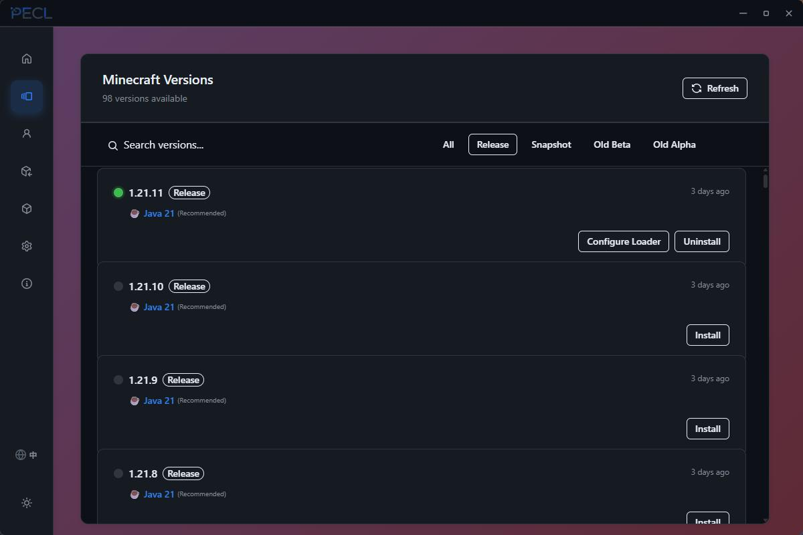

  

<h1 align="center">PECL</h1>

  <strong>Windows 一个轻量、干净的新第三方Minecraft启动器</strong>

  聚焦版本安装、Java 管理、资源下载、实例隔离、社区功能与持续打磨的启动体验。

  
  
  

  

---

PECL 是一个面向 Windows 的 Minecraft 桌面启动器。当前产品重点不是单纯“能启动”，而是更顺手地完成这一条主链路：

`选择实例 -> 搜索资源 -> 安装 -> 启动游戏 -> 出问题可恢复`

这个公开仓库主要用于：

- 发布安装包与更新清单
- 展示产品信息与版本说明
- 收集公开反馈与使用问题

私有开发源码仓库不直接镜像到这里。

## 当前版本

- 最新公开版本：[v0.3.0](https://github.com/Pumnn1ayLee/PECL/releases/tag/v0.3.0)
- 推荐安装包：`PECL_0.3.0_x64-setup.exe`
- 发布页入口：[GitHub Releases](https://github.com/Pumnn1ayLee/PECL/releases)

## 目前已支持

- Minecraft 版本安装与实例管理
- Java 检测、托管下载、自动选择、手动指定与外部 Java 隐藏/恢复
- Forge、Fabric、OptiFine 工作流支持
- Mod、整合包、资源包、光影包、数据包的浏览、下载与管理
- 资源隔离、任务进度同步、安装反馈与更新器发布链路
- 社区浏览与持续扩展中的社区功能入口

## 0.3.0 更新重点

- 修复从其他页面切换到资源管理页时 Mod 管理闪烁的问题
- 整合包、资源包、光影包浏览器支持继续下拉加载更多结果
- 打开 Mod 浏览器时会自动执行默认搜索
- 优化 Java 管理：区分 PECL 托管与外部 Java，支持隐藏与恢复外部 Java，隐藏后不再参与自动回退

## 下载与使用

- 从 [Releases](https://github.com/Pumnn1ayLee/PECL/releases) 页面下载最新的 Windows 安装包
- 首选 `x64` 安装程序
- 如果 Windows SmartScreen 弹出提示，请确认来源后再继续

## 项目定位

PECL 现在更像一个“Minecraft 启动与资源管理工作台”，而不只是单一版本启动器。它希望把版本、Java、Mod、整合包和资源内容管理收拢到一个更清晰、更稳定的桌面工作流里。

## 反馈

如果你在使用 PECL 时遇到问题，欢迎在这个仓库提交 Issue。建议附上这些信息：

- PECL 版本号
- Windows 版本
- 具体操作步骤
- 截图、日志或报错信息

感谢关注 PECL。

## 想说的话

